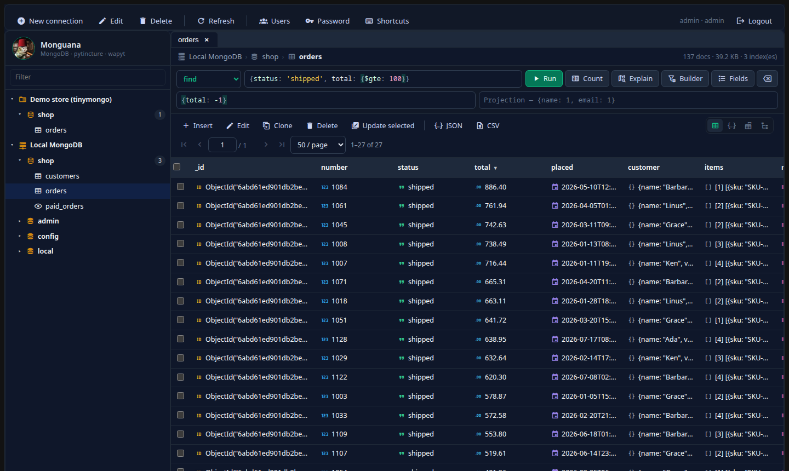

# Monguana

[](LICENSE)
[]()

A self-hosted, browser-based MongoDB manager: a clean alternative to Compass
that runs in your browser and stays under your control. It also opens
[tinymongo](https://pypi.org/project/tinymongo/) stores — MongoDB-style
databases in SQLite, JSON, DuckDB or Parquet files, no server needed — and any
backend a plugin adds.



**📖 The [wiki](https://github.com/El-Iguana/monguana_wapyt/wiki) is the user
guide**: installing, connections, querying, indexes, dump and copy, tinymongo,
plugins, administration and troubleshooting.

Version 2 is a rewrite of the original Monguana (FastAPI, Motor and vanilla
JavaScript) onto [pytincture](https://github.com/pytincture/pytincture) and the
[wapyt](https://github.com/WAwesome-AI/wa_pytincture_widgetset) widgetset: the
UI is Python running in the browser under Pyodide instead of ~2,800 lines of
hand-written JavaScript, and the hand-rolled REST API is replaced by
pytincture's backend-for-frontend layer.

## Features

**Connections.** Saved profiles per user — host, port, credentials, auth
database, TLS — or a full connection string (`mongodb+srv://` for Atlas), or a
tinymongo store. Test from the editor before saving. Passwords are encrypted
at rest and never sent back to the browser.

**Backends.** A connection's **Connects to** chooses MongoDB, **tinymongo**
(an engine and a folder inside an administrator-chosen root), or a backend
added by a **plugin** (`monguana.backends` entry point; see
[docs/BACKEND_PLUGINS.md](docs/BACKEND_PLUGINS.md) and the working example in
`examples/`). Menus and dialogs only offer what the connection's backend can
do, and fall back where it can: a tinymongo collection has no Explain or
Rename, and its statistics are a document count.

**Sidebar tree.** Server → database → collection, loaded as you expand, with a
right-click menu that fits what you clicked: create or drop databases, create,
rename or drop collections, indexes, statistics, dump, restore and copy. MongoDB's
own `system.*` collections are hidden unless you ask for them.

**Collection tabs.** As many as you like, several on one collection, each with
its own query, page and view.

- **Table, JSON and tree views.** The table's columns are the union of every
  document on the page; a header click sorts on the server, not just the page
  on screen. Drag a column's edge to resize it or its header to move it; the
  layout — and whether you last looked at a collection as a table, JSON or a
  tree — is remembered per collection, for you, on any browser. The tree view
  caps its depth and size and says when it does.
- **A code editor in every query box and the document editor** (CodeMirror 6,
  bundled — no CDN): highlighting, bracket matching, and completions for
  operators, BSON helpers and the collection's field paths.
- **Filter, sort, projection** in mongo shell syntax: unquoted keys,
  `ObjectId("…")`, `ISODate("…")`, `NumberDecimal("…")`, `UUID("…")`, regex
  literals `/^ab/i`, comments. Extended JSON works too — what the viewer shows
  pastes straight back with its types.
- **Visual query builder:** conditions as rows — field, operator, value type,
  value — combined with AND or OR, with a live preview of the filter. Values
  are written as their type (dates as `ISODate`, ids as `ObjectId`, zip codes
  stay strings), defaulting to the type the field was sampled with.
- **Query modes:** `find`, `aggregate`, `updateOne`, `updateMany`,
  `deleteOne`, `deleteMany`. Writes show how many documents match and the
  first 20 of them, and wait for you to confirm.
- **Pagination** with first/last and jump-to-page; **Count**; **Explain**
  (which index, how many documents examined).
- **Fields:** a sampled list of every field path and its types; add one to the
  filter, the sort or the projection with a click.

**Documents.** Insert (one or many), edit, clone, delete; select rows for bulk
delete or a bulk update with any operators. The editor always loads the whole
document, so a projection can never make a save drop fields, and the whole
document is saved, so a field you delete is really deleted.

**Aggregation.** The pipeline as stage cards — each with its own editor, run
up to that stage, move, disable or remove — or as raw text, switching freely
between the two. Read-only by design: `$out` and `$merge` are refused at any
depth, including inside `$lookup` and `$facet`.

**Indexes.** List with sizes, create (compound, unique, sparse, TTL, partial,
hidden, text, 2dsphere, hashed, wildcard, collation), edit, hide from the
query planner, and drop. An edit shows its plan first: TTL, hidden and
turning unique on are changed in place; anything else rebuilds the index —
building the new one before dropping the old when it is renamed, and
restoring the old one if a same-name rebuild fails.

**Export, dump, restore, copy.** Export every match of the current query as
JSON or CSV. Dump a database or a collection in `mongodump` layout (BSON +
index metadata, ZIP), restore it here or with `mongorestore`; restore a zipped
`mongodump` directory here, skipping, replacing or dropping what exists.
**Copy** a database or collection straight into any of your connections —
MongoDB to tinymongo, or back. All of it works on every backend, and runs in
the background with a progress console — a bar per collection, a log, and
Cancel — and the restore upload shows its own progress.

**Accounts.** Multiple users with their own connection profiles, an admin
panel, and password changes.

**Keyboard.** `Enter` runs from the filter, `Ctrl+Enter` from anywhere in a
view, `/` focuses the filter, `N` inserts, `I` opens indexes, `Ctrl+S` saves in
the editor, `?` lists them all.

## Installing

Monguana runs as a container, with **Docker or Podman on Windows, macOS or
Linux**. **[INSTALL.md](INSTALL.md)** has the full instructions — engines,
reaching a MongoDB on the same computer, HTTPS for other machines, backups,
troubleshooting. In short:

```sh
git clone https://github.com/El-Iguana/monguana_wapyt.git
cd monguana_wapyt
cp .env.example .env              # set MONGUANA_ADMIN_PASS
docker compose up -d --build      # or: podman compose up -d --build
```

Then open <http://127.0.0.1:8766/monguana> — `127.0.0.1`, not `localhost` —
and sign in as `admin`. tinymongo is on in the container, with its stores on
the `monguana-tinymongo` volume; add its DuckDB and Parquet engines, or
plugins, with `MONGUANA_EXTRA_PACKAGES` in `.env`.

**Windows without Docker:** a native installer is attached to each
[release](https://github.com/El-Iguana/monguana_wapyt/releases) — see
[INSTALL.md §11](INSTALL.md#11-windows-without-docker-native-installer).

### Running from source (development)

Requires Python 3.13+, [uv](https://docs.astral.sh/uv/) and the wapyt
checkout next to this one at `../wa_pytincture_widgetset`:

```sh
cp .env.example .env
uv sync                                                   # --extra duckdb --extra parquet for those engines
../wa_pytincture_widgetset/scripts/dev_wheel.sh appcode   # the wheel the browser installs
uv run python service.py
```

tinymongo stays off in a source run until `MONGUANA_TINYMONGO_ROOT` names a
folder. More in the wiki's [Development](https://github.com/El-Iguana/monguana_wapyt/wiki/Development) page.

## Configuration

| Variable | Default | Meaning |
|---|---|---|
| `MONGUANA_ADMIN_USER` / `_PASS` | `admin` / `change_me` | First account, created when there are no users; asked to change its password on every load until it does |
| `MONGUANA_DATA_DIR` | `./data` | SQLite database, `secret.key`, `session.key` |
| `MONGUANA_SECRET_KEY` | generated | Fernet key for stored passwords — back it up |
| `MONGUANA_SESSION_SECRET` | generated | Cookie signing secret |
| `MONGUANA_PORT` | `8766` | Port on the host, with compose |
| `PORT` | `8766` | Listen port of the service itself |
| `MONGUANA_BIND` | `0.0.0.0` | Listen address (the container sets `127.0.0.1`) |
| `MONGUANA_CANONICAL_ORIGIN` | `http://127.0.0.1:PORT` | The one origin the app is reached on |
| `MONGUANA_ALLOWED_HOSTS` | `127.0.0.1` | Host names accepted, comma-separated |
| `MONGUANA_MAX_RESTORE_BYTES` | 1 GiB | Largest dump ZIP accepted |
| `MONGUANA_TINYMONGO_ROOT` | container `/tinymongo`; unset from source (off) | The only folder tinymongo connections may open |
| `MONGUANA_EXTRA_PACKAGES` | — | Packages built into the image (compose): tinymongo engines, backend plugins |

`python manage.py backends` lists the backends in use, and any plugin that
failed to load.

## Security

- Every account's connection profiles are its own; passwords and connection
  strings are Fernet-encrypted at rest and never returned to the browser.
- Server-side JavaScript (`$where`, `$function`, `$accumulator`) is refused
  anywhere in a query, arrays included. Pipelines are read-only.
- Queries are time-limited on the server (30 s; counts 5 s).
- tinymongo connections can only open folders inside `MONGUANA_TINYMONGO_ROOT`,
  checked again on every use (`..`, absolute paths and symlinks out are refused).
- Backend plugins run inside the server with full access: install only what
  you trust.
- The container runs as an unprivileged user and binds to loopback.
- **Do not expose Monguana without TLS in front.** It holds credentials for
  your databases.

## Documentation

- **[Wiki](https://github.com/El-Iguana/monguana_wapyt/wiki)** — the user guide.
- **[INSTALL.md](INSTALL.md)** — every installation route, step by step.
- **[docs/BACKEND_PLUGINS.md](docs/BACKEND_PLUGINS.md)** — writing a backend plugin.
- **[ROADMAP.md](ROADMAP.md)** — what each phase did, and what is next.

## Tests

```bash
uv run --group dev pytest                          # unit tests (tinymongo on every engine installed)
MONGUANA_TEST_MONGO='127.0.0.1:27018:root:secret' \
  uv run --group dev pytest tests/test_live.py     # against a real MongoDB
MONGUANA_PASS=… python3 tests/smoke/ui_smoke.py     # the UI, in Chromium
```

## License

MIT.
